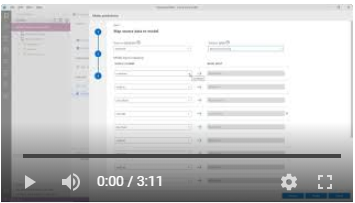

# Machine Learning Extension in Azure Data Studio

In this example, we will use Boston dataset and ONNX model.

Microsoft docs: http://aka.ms/AzureDataStudioML

Video:
1. [Make Predictions using Machine Learning Extension (Preview) in Azure Data Studio](./MLExtension-MakePredictions.mp4))\

