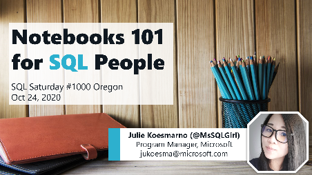

# Welcome to Notebooks 101 for SQL People
## SQL Saturday #1000 Oregon (virtual)
https://www.sqlsaturday.com/1000/

Presenter: Julie Koesmarno [@MsSQLGirl](http://twiter.com/MsSQLGirl) \
Oct 24, 2020

## Abstract
_Are you a database developer, a DBA or a data analyst? Do you find spending quite a bit of time trying to reproduce analysis or reproduce issues and the troubleshooting techniques? This Notebooks 101 session is for you!_

_The lack of rigor in being able to reproduce analysis in business context or to reproduce data troubleshooting can lead to confusion and time wasted on work that had been previously done. With Notebooks, Data Professionals can share their techniques and data sources used for the data analysis or troubleshooting for code review and reproducible insights/troubleshooting._

_Azure Data Studio Notebooks support SQL and KQL natively with intellisense; with easy to use charting capabilities. With Notebooks and Jupyter Book (collection of Notebooks) in Azure Data Studio, it’s also easy now for your team to build an onboarding guide (user manual) / documentation on data sources, useful sample scripts and tutorials._

## Resources used at SQL Saturday #1000 Oregon:
1. [Slide Deck](https://github.com/MsSQLGirl/jubilant-data-wizards/raw/main/Notebooks%20Presentations/SQL%20Saturday%201000%20Oregon/20201024%20-%20Notebooks%20101%20for%20SQL%20People.pptx)
2. [Notebook Templates](https://github.com/MsSQLGirl/jubilant-data-wizards/tree/main/Notebook%20Templates)
3. Notebook Demo:
    - [Data Analysis with SQL Notebooks](https://github.com/MsSQLGirl/jubilant-data-wizards/blob/main/Simple%20Demo/Sample%20Notebooks%20-%20Data%20Analysis/WWIReproducibleResearch%20Vol%201.ipynb)
    - [Data Analysis with Python Notebooks](https://github.com/MsSQLGirl/jubilant-data-wizards/blob/main/Simple%20Demo/Sample%20Notebooks%20-%20Data%20Analysis/ReproducibleResearch.ipynb)
    - [Convert SQL scripts / PowerShell scripts to Notebooks](https://github.com/MsSQLGirl/jubilant-data-wizards/blob/main/Useful%20Notebooks/DemoConvertToNotebooks.ipynb)
4. Remote Jupyter Book sample that you can use to download to Azure Data Studio directly: https://github.com/MsSQLGirl/jubilant-data-wizards/releases/tag/v0.0.0

## Other useful resources:
1. [How to use Jupyter Notebooks in Azure Data Studio | Azure Friday](https://www.youtube.com/watch?v=pHuRj9ty9cI)
2. [PowerShellNotebook](https://github.com/dfinke/PowerShellNotebook)
