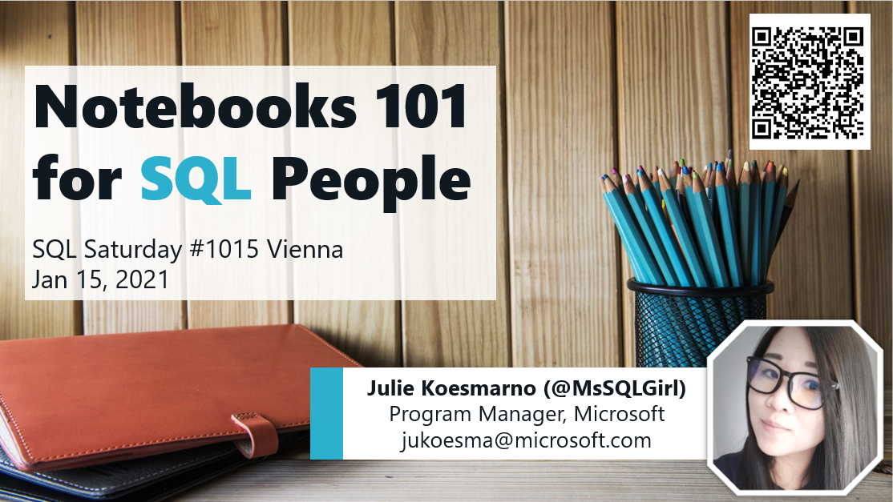

# Welcome to Notebooks 101 for SQL People
## [SQL Saturday #1015 Vienna (virtual)](https://sqlusergroupaustria.wordpress.com/2021/01/08/sqlsaturday-vienna-2021-schedule/)

Presenter: Julie Koesmarno [@MsSQLGirl](http://twiter.com/MsSQLGirl) \
Jan 15, 2021

## Abstract
_Are you a database developer, a DBA or a data analyst? Do you find spending quite a bit of time trying to reproduce analysis or reproduce issues and the troubleshooting techniques? This Notebooks 101 session is for you!_

_The lack of rigor in being able to reproduce analysis in business context or to reproduce data troubleshooting can lead to confusion and time wasted on work that had been previously done. With Notebooks, Data Professionals can share their techniques and data sources used for the data analysis or troubleshooting for code review and reproducible insights/troubleshooting._

_Azure Data Studio Notebooks support SQL and KQL natively with intellisense; with easy to use charting capabilities. With Notebooks and Jupyter Book (collection of Notebooks) in Azure Data Studio, it’s also easy now for your team to build an onboarding guide (user manual) / documentation on data sources, useful sample scripts and tutorials._

## Resources used at SQL Saturday #1015 Vienna:
1. [Slide Deck](https://github.com/MsSQLGirl/jubilant-data-wizards/blob/main/Notebooks%20Presentations/SQL%20Saturday%201015%20Vienna/20210115%20-%20Notebooks%20101%20for%20SQL%20People.pptx)
2. Download the latest Azure Data Studio at http://aka.ms/getAzureDataStudio  
  > [Azure Data Studio](http://aka.ms/AzureDataStudio) is a cross platform (Windows, macOS and Linux) client tool for modern data experiences. In this presentation, I specifically used Azure Data Studio for all the demos with occassional GitHub Jupyter Notebook viewer. 
3. Notebook Demo:
    - [Data Analysis with SQL Notebooks](https://github.com/MsSQLGirl/jubilant-data-wizards/blob/main/Simple%20Demo/Sample%20Notebooks%20-%20Data%20Analysis/WWIReproducibleResearch%20Vol%201.ipynb)
    - [Data Analysis with Python Notebooks](https://github.com/MsSQLGirl/jubilant-data-wizards/blob/main/Simple%20Demo/Sample%20Notebooks%20-%20Data%20Analysis/ReproducibleResearch.ipynb)
    - [Convert SQL scripts / PowerShell scripts to Notebooks](https://github.com/MsSQLGirl/jubilant-data-wizards/blob/main/Useful%20Notebooks/DemoConvertToNotebooks.ipynb)
4. Remote Jupyter Book sample that you can use to download to Azure Data Studio directly: https://github.com/MsSQLGirl/jubilant-data-wizards/releases/tag/v0.0.0
5. Tiger Toolbox Jupyter Notebooks: https://github.com/microsoft/tigertoolbox/releases

## Other Jupyter Notebooks built by the Data community
1. Glenn Berry’s Diagnostic Notebooks for SQL Server and Azure SQL DB: https://glennsqlperformance.com/resources/ 
2. Rob Sewell's Notebooks (PowerShell and .net interactive): http://sqldbawithabeard.com and https://github.com/SQLDBAWithABeard/JupyterNotebooks   
3. Emanuele Meazzo's SQL Diagnostic Jupyter book: https://tsql.tech/the-sql-diagnostic-jupyter-book/     

## Other useful resources:
1. [How to use Jupyter Notebooks in Azure Data Studio | Azure Friday](https://www.youtube.com/watch?v=pHuRj9ty9cI)
2. [PowerShellNotebook](https://github.com/dfinke/PowerShellNotebook) module created by Doug Finke 
3. [WideWorldImporters sample database to restore to your SQL Server / Azure SQL DB](https://github.com/Microsoft/sql-server-samples/releases/tag/wide-world-importers-v1.0)
4. [.net interactive notebooks in Azure Data Studio](https://channel9.msdn.com/Shows/Data-Exposed/Jupyter-Launch-NET-Interactive-Notebooks--Data-Exposed-MVP-Edition) with Rob Sewell and Anna Hoffman at Data Exposed. 
5. [Notebook Templates for Troubleshooting Guide, Data Analysis and HowTo tutorials](https://github.com/MsSQLGirl/jubilant-data-wizards/tree/main/Notebook%20Templates)
6. [Request new features or report an issue on Azure Data Studio GitHub](https://github.com/microsoft/azuredatastudio/issues)

## FAQ
1. Does SQL Notebooks work only for SQL Server?  
It works for SQL Server, Azure SQL DB + Managed Instance and PostgreSQL. See [PostgreSQL extension in Azure Data Studio documentation](https://docs.microsoft.com/en-us/sql/azure-data-studio/extensions/postgres-extension?view=sql-server-ver15).

2. Does the resultset support spatial data type?  
Not currently. Please vote [Spatial support feature request](https://github.com/microsoft/azuredatastudio/issues/267)

3. Is it possible to export result set of notebooks to Excel or PDF
In Azure Data Studio, there are a few buttons on top of the result set that you can use to export result set to another file format. There is no native support for exporting to PDF in Azure Data Studio today - however, check out [How to convert Jupyter notebooks into PDF](https://towardsdatascience.com/how-to-convert-jupyter-notebooks-into-pdf-5accaef3758).

4. Using the SQL Notebook, is it possible to join to many other data sources (PostgreSQL and SQL Server)?  
No. Currently, this would require Python. (Unless you have [EXTERNAL DATA SOURCE](https://docs.microsoft.com/sql/t-sql/statements/create-external-data-source-transact-sql) defined in SQL Server).

5. What's the best way to share notebooks?  
    - A great way to start is using Source Control, like git system which is supported in Azure Data Studio natively.
    - Another way is to ship this as Jupyter Remote Book in GitHub.
    - Create an extension to package your Jupyter Book like [SQL Server Diagnostic Book as an Extension](https://github.com/EmanueleMeazzo/tsql.tech-Code-snippets/releases/tag/v1.0).
    
6. How do I keep up with Azure Data Studio releases?  
Check out [Azure Data Studio release blog post](https://cloudblogs.microsoft.com/sqlserver/?product=azure-data-studio) or [Release Notes](https://docs.microsoft.com/sql/azure-data-studio/release-notes-azure-data-studio).  Also follow [@AzureDataStudio](http://twitter.com/AzureDataStudio] on twitter.  

A shout out to my PM colleagues, [Alan Yu](https://twitter.com/AlanYuSQL) and [Drew Skwiers-Koballa](https://twitter.com/SysAdminDrew), who are also active on Twitter on tips & tricks including new releases of Azure Data Studio. 

7. Where should I submit feature request or report issues? 
http://aka.ms/askAzureDataStudio or follow us on twitter [@AzureDataStudio](http://aka.ms/AzureDataStudio). 
