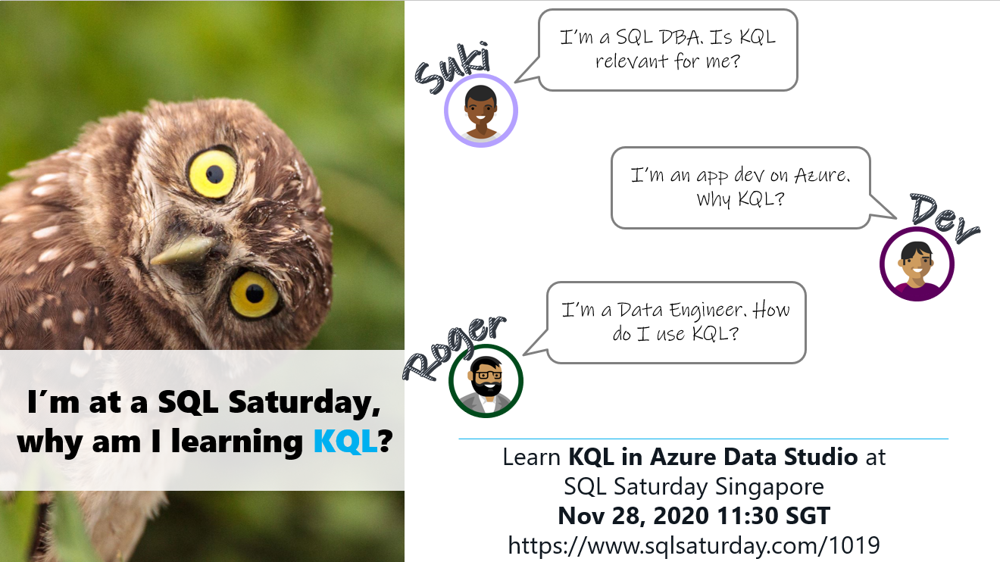

# Welcome to Kusto Query Language (KQL) in Azure Data Studio 
## SQL Saturday #1019 Singapore (virtual)
https://www.sqlsaturday.com/1019/

Presenter: Julie Koesmarno [@MsSQLGirl](http://twiter.com/MsSQLGirl) \
Nov 28, 2020



## Abstract
_Join this session to learn more about the Kusto Query Language (KQL) experiences in Azure Data Studio. This is a quick overview session on how to get started with KQL in Azure Data Studio. You'll learn how to connect to Azure Data Explorer and Azure Log Analytics in notebooks. In this demo-filled session, you will also learn a practical example of analyzing Azure SQL database log stored in an Azure Log Analytics workspace._

## Resources used at SQL Saturday #1000 Oregon:
1. [Slide Deck](https://github.com/MsSQLGirl/jubilant-data-wizards/blob/main/Notebooks%20Presentations/SQL%20Saturday%201019%20Singapore/20201128%20-%20Kusto%20Query%20Language%20(KQL)%20in%20Azure%20Data%20Studio.pptx)
2. [Notebook Templates](https://github.com/MsSQLGirl/jubilant-data-wizards/tree/main/Notebook%20Templates)
3. Native Kusto demo:
    - [Native Kusto - Aggregates in KQL](https://github.com/MsSQLGirl/jubilant-data-wizards/blob/main/Simple%20Demo/Sample%20Notebooks%20-%20Data%20Analysis/NativeKusto-AggregatesInKusto.kql)
    - [Native Kusto - Simple Kusto Demo](https://github.com/MsSQLGirl/jubilant-data-wizards/blob/main/Simple%20Demo/Sample%20Notebooks%20-%20Data%20Analysis/NativeKusto-SimpleKustoNotebook.ipynb)
    - [Cross cluster querying with Kusto Notebook](https://github.com/MsSQLGirl/jubilant-data-wizards/blob/main/Simple%20Demo/KQL%20Notebooks/Demo-NativeKusto-CrossClusterQuery.ipynb)
4. Kqlmagic Demo
    - [Kqlmagic - Log Analytics](https://github.com/MsSQLGirl/jubilant-data-wizards/blob/main/Simple%20Demo/KQL%20Notebooks/Demo-KqlmagicLogAnalyticsWithUserAuth.ipynb)
    - [Analyzing Log Analytics Data with Client Secret auth](https://github.com/MsSQLGirl/jubilant-data-wizards/blob/main/Simple%20Demo/KQL%20Notebooks/Demo-KqlmagicLogAnalyticsWithClientSecret.ipynb)
    - [Parameterized with Kqlmagic Notebook with Papermill](https://github.com/MsSQLGirl/jubilant-data-wizards/blob/main/Simple%20Demo/KQL%20Notebooks/Demo-ExecuteParameterizedNotebookKqlmagicLogAnalyticsWithClientSecret.ipynb)


## Other useful resources:
1. Azure Data Studio http://aka.ms/getAzureDataStudio 
2. [Using Kusto Query Language in Azure Data Studio at Data Exposed, Channel 9](https://www.youtube.com/watch?v=Da1WfrLRl9s)
3. [Azure Data Studio Notebooks Power Hour at DPS2020, 3 Dec 2020](https://dataplatformgeeks.com/dps2020/session/azure-data-studio-notebooks-power-hour/)
4. [Analyze data in Azure Data Explorer using Kusto Query Language (KQL) extension in Azure Data Studio](https://cloudblogs.microsoft.com/sqlserver/2020/09/24/analyze-data-in-azure-data-explorer-using-kusto-query-language-kql-extension-in-azure-data-studio/)  
Sample files https://github.com/MsSQLGirl/jubilant-data-wizards/tree/main/Simple%20Demo/KQL%20Notebooks 
5. [Learn KQL at Pluralsight for Free](https://www.pluralsight.com/courses/kusto-query-language-kql-from-scratch)


## FAQ

**1. Can you connect to Log Analytics in Azure Data Studio?** 

Yes. In Native Kusto, the current workaround is through Azure Data Explorer Proxy, i.e. connect to help.kusto.windows.net cluster, then qualify the Log Analytis table with the `cluster().database()` path.  
For example:  
Querying top 10 rows of AzureDiagnostics table in a Log Analytics workspace.  
```
cluster('https://ade.loganalytics.io/subscriptions/<SubscriptionID>/resourcegroups/<ResourceGroupName>/providers/microsoft.operationalinsights/workspaces/<WorkspaceName>').database('<WorkspaceName>').AzureDiagnostics | take 10
```

Using Kqlmagic in a notebook, simply use the following:  
The Workspace ID is a GUID of the Log Analytics workspace as specified on Azure Portal.
```
%kql loganalytics://code;workspace='<WorkspaceID>'
```

The Workspace ID is a GUID of the Log Analytics workspace as specified on Azure Portal. Specify the TenantID in case you are working with multiple tenants / Azure accounts. 
```
%kql loganalytics://tenant=<TenantID>;workspace='<WorkspaceID>'
```


**2. Does the resultset support spatial data type?**

Not currently. Please vote [Spatial support feature request](https://github.com/microsoft/azuredatastudio/issues/267)

**3. How do I enable auditing for Azure SQL Database and Azure Synapse Analytics?** 

Through Azure Portal as per [Auditing for Azure SQL Database and Azure Synapse Analytics](https://docs.microsoft.com/en-us/azure/azure-sql/database/auditing-overview)
For Azure SQL's diagnostics, [Configure streaming export of Azure SQL Database and SQL Managed Instance diagnostic telemetry](https://docs.microsoft.com/en-us/azure/azure-sql/database/metrics-diagnostic-telemetry-logging-streaming-export-configure?tabs=azure-portal)


**4. Are there any good examples of queries on Log Analytics to understand what's going on with my Azure SQL DB?**

As of 11/27, I don't have anything handy. I'll find out :) 

To get started, I recommend:
* [Useful queries by Azure Monitor community on GitHub](https://github.com/microsoft/AzureMonitorCommunity/tree/master/Azure%20Services/SQL%20databases/Queries)
* [Azure SQL DB and Log Analytics better together series](https://techcommunity.microsoft.com/t5/azure-database-support-blog/azure-sql-db-and-log-analytics-better-together-part-1/ba-p/794833#:~:text=%20AZURE%20SQL%20DB%20AND%20LOG%20ANALYTICS%20BETTER,the%20database%20using%20a%20language%20called...%20More%20)

**5. Is the `render` syntax supported in Azure Data Studio**
* Native Kusto - not yet. Please request this feature [here](https://github.com/microsoft/azuredatastudio/issues).
* Kqlmagic - yes, it is integrated with plotly in Notebooks in Azure Data Studio.
