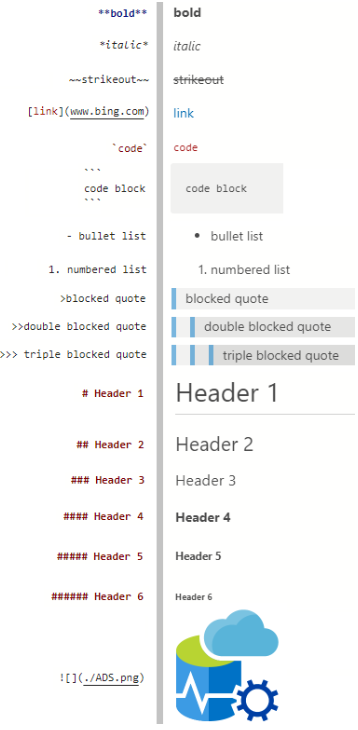

# Notebooks 101 in Azure Data Studio

Prepared by: Julie Koesmarno (twitter: [@MsSQLGirl](http://twitter.com/MsSQLGirl))

[](./images/ADSHeartNotebooks.png "ADS loves Notebooks")

**http://aka.ms/AzureDataStudio** to learn more about Azure Data Studio and to download it.


## Table of Contents

1. [What is a notebook? And why?](#what-is-a-notebook-and-why)
2. [Fun facts about Notebooks in Azure Data Studio](#fun-facts-about-notebooks-in-azure-data-studio)
3. [More notebook users](#more-notebook-users)
4. [Examples](#examples)
5. [Anatomy](#anatomy)
6. [Markdown cheatsheet](#markdown-cheatsheet)
7. [Linking to other parts of notebooks](#linking-to-other-parts-of-notebooks)
8. [Demo](#demo)
9. [Notebook use cases](#notebook-use-cases)  
  1. [Exploratory / Academic / Collaborative - *original intention*](#exploratory--academic--collaborative---original-intention)
  2. [Broader analysis - *app operations*](#broader-analysis---app-operations)  
  3. [DBA Scenarios / examples - *data, automation and DevOps use cases*](#dba-scenarios--examples---data-automation-and-devops-use-cases)  
10. [Useful links for getting started with Notebooks in Azure Data Studio!](#useful-links-for-getting-started-with-notebooks-in-azure-data-studio)


## What is a notebook? And why?
A *Jupyter* notebook is a tool for interactively developing and presenting Data Science projects ([source](https://towardsdatascience.com/a-beginners-tutorial-to-jupyter-notebooks-1b2f8705888a)). Project *Jupyter* is open source.

More use cases have landed since then! Most importantly because:
* **documentation** + **code** + **results** + **visualization** can now be in **one place**, and
* the **reproducible framework** around notebooks is beneficial beyond data science.

More open source contributors developing all sorts of wonderful things that support the operational / workflow side of this! 

**SQL People** can benefit the reproducible data exploratory aspect of notebooks today using Azure Data Studio!


## Fun facts about Notebooks in Azure Data Studio: 
* Sep 2018: Notebook first introduced in Azure Data Studio
* Mar 2019: SQL Notebooks
* Nov 2019: Jupyter Book & PowerShell Notebooks
* Apr 2020: Kqlmagic for Kusto queries in Python notebook

## Meet Notebook users 

| Data Scientist | Data Analyst | Data Engineer | DBA |
| --- | --- | --- | --- |
| [](./images/DataScientist.png "Data Scientist") | [](./images/DataAnalyst.png "Data Analyst") | [](./images/DataEngineer.png "Data Engineer") |  [](./images/DBA.png "DBA") |
| **Typical kernels:** | | | |
| Python, R, SQL | SQL, Python, R | Spark, Python, SQL | SQL, PowerShell | 

<br />


## Examples
Simple Reproducible Research example - [click here](azuredatastudio://microsoft.notebook/open?url=https://raw.githubusercontent.com/MsSQLGirl/jubilant-data-wizards/master/Simple%20Demo/Sample%20Notebooks%20-%20Data%20Analysis/ReproducibleResearch.ipynb) to display it in Azure Data Studio. 


## Anatomy 
* Text Cell - Plain text, markdown, HTML, code snippets and more!
    * Plain Text **and** *simple* markdown ***formatting***
    * HTML support for <mark>advanced</mark> ~~complex~~ formatting
    * Code format
~~~SQL
SELECT TOP 10 * FROM [sys].[databases]
~~~
    * Multimedia / Image as shown above.


* Execution Cell - Code and output
    * Visualizations / graphics 

> **tip**: \
> If you are sharing Notebooks to others publicly, ensure that the results don't include sensitive information. 


## Markdown Cheatsheet



## Linking to other parts of notebooks

Github Flavored Markdown (GFM) which is what Azure Data Studio adopts, extends the standard Markdown standard so that all Markdown-rendered headers automatically get IDs, which can be linked to, except in comments. Below is a useful description from the [Gitlab](https://docs.gitlab.com/ee/user/markdown.html#header-ids-and-links) page.

On hover, a link to those IDs becomes visible to make it easier to copy the link to the header to use it somewhere else.

The IDs are generated from the content of the header according to the following rules:

1. All text is converted to lowercase.
2. All non-word text (such as punctuation or HTML) is removed.
3. All spaces are converted to hyphens.
4. Two or more hyphens in a row are converted to one.
5. If a header with the same ID has already been generated, a unique incrementing number is appended, starting at 1.

Example:

```
# This header has spaces in it
## This header has a :thumbsup: in it
# This header has Unicode in it: 한글
## This header has spaces in it
### This header has spaces in it
## This header has 3.5 in it (and parentheses)

```

Would generate the following link IDs:

1. `this-header-has-spaces-in-it`
2. `this-header-has-a-in-it`
3. `this-header-has-unicode-in-it-한글`
4. `this-header-has-spaces-in-it-1`
5. `this-header-has-spaces-in-it-2`
6. `this-header-has-3-5-in-it-and-parentheses`

Note that the emoji processing happens before the header IDs are generated, so the emoji is converted to an image which is then removed from the ID.

### Cross Referencing examples
This includes linking to Headers in this notebook, generic parts within this notebook (with `<a id>` reference) and other notebook's parts.

Here's an example of linking to other parts of this notebook:
1. [Heading: Demo](#demo), which is located immediately below this text cell.
2. [Heading: Notebooks Use Cases](#notebooks-use-cases), which is located below the Demo text cell.
3. [Anchor with ID: The Ops Side](#the-ops-side), which is located as part of the Notebook Use Cases text cell. 
4. [Heading: Markdown](#markdown-cheatsheet), which is located above this text cell. 
5. [Top of this notebook](#notebooks-101-in-azure-data-studio), which is located on top of this notebook.

Here's an example of linking to other part of another notebook ([SimpleSQLNotebook.ipynb](../SimpleSQLNotebook.ipynb)):
1. [Heading: Get a list of databases](../SimpleSQLNotebook.ipynb#get-a-list-of-databases)
1. [Anchor with ID: SELECT statement in a text cell](../SimpleSQLNotebook.ipynb#code-format)
1. [Another option for launching Azure Data Studio to open SimpleSQLNotebook.ipynb copy on GitHub](azuredatastudio://microsoft.notebook/open?url=https://raw.githubusercontent.com/MsSQLGirl/jubilant-data-wizards/main/Simple%20Demo/SimpleSQLNotebook.ipynb#get-a-list-of-databases)


## Demo 
1. Navigating the controls in Azure Data Studio. \
Anatomy, Toolbar, Markdown Toolbar, Notebook Viewlet.
2. Creating a SQL notebook \
Text, Code, Results, Charting
3. Creating a Powershell notebook
4. Creating a book \
Create a book and searching
5. Container deployment notebook 


## Notebooks Use Cases 

Notebook journey starts with **Exploratory / Academic / Collaborative / Reproducible** nature, then it's used for **broader analysis for app operations**. We are now seeing more adoption of Notebook in **DBA and data work (management / analysis / visualization)**.

### Exploratory / Academic / Collaborative - *original intention*
* [Simple Reproducible Research example on Github](https://github.com/MsSQLGirl/jubilant-data-wizards/blob/master/Simple%20Demo/Sample%20Notebooks%20-%20Data%20Analysis/ReproducibleResearch.ipynb)
* [Typical Data Science example on GitHub](https://github.com/rhiever/Data-Analysis-and-Machine-Learning-Projects/blob/master/example-data-science-notebook/Example%20Machine%20Learning%20Notebook.ipynb) | [View this in Azure Data Studio](azuredatastudio://microsoft.notebook/open?url=https://raw.githubusercontent.com/rhiever/Data-Analysis-and-Machine-Learning-Projects/master/example-data-science-notebook/Example%20Machine%20Learning%20Notebook.ipynb)
* [NBA Games in Notebooks](https://github.com/DunderData/Tutorials/blob/master/Data%20Analysis%20and%20Visualization%20Tutorials/Matplotlib%20Tutorials/NBA%20Full%20Game%20Animation.ipynb)

### Broader analysis - *app operations*
* [Malicious detection](https://hub.gke.mybinder.org/user/johnlatwc-shared-psdjmbbn/notebooks/notebooks/Malware%20Decode%20Demo.ipynb)
* [Malware Powershell shellcode analysis by @JohnLaTwC](https://github.com/JohnLaTwC/Shared/blob/master/notebooks/Malware%20PowerShell%20shellcode%20analysis.ipynb)  | [View this in Azure Data Studio](azuredatastudio://microsoft.notebook/open?url=https://raw.githubusercontent.com/JohnLaTwC/Shared/master/notebooks/Malware%20PowerShell%20shellcode%20analysis.ipynb)


### DBA Scenarios / examples - *data, automation and DevOps use cases*
* Runbooks: [SQL Assessment](https://github.com/microsoft/sql-server-samples/blob/master/samples/manage/sql-assessment-api/notebooks/SQLAssessmentAPIQuickStartNotebook.ipynb)
* Troubleshooting: 
    * Jupyter Book created based on Glenn Berry's Diagnostic Queries - check out his [blog](https://glennsqlperformance.com/resources/) or from [dbatools GitHub](https://github.com/sqlcollaborative/dbatools/tree/development/bin/diagnosticquery).
        * Here's an example for [SQL Server 2019 Diagnostic Query in SQL](https://www.dropbox.com/s/k1vauzxxhyh1fnb/SQL%20Server%202019%20Diagnostic%20Information%20Queries.sql?dl=0)
    * **SQL Server 2019 Guide Jupyter Book** -> From Command Palette (Ctrl + Shift + P), type "Jupyter Books: SQL Server 2019 Guide".
    * Your own!
* Notebooks for **deploying SQL Server containers** -> From Command Palette (Ctrl + Shift + P), type "Deployment: New Deployment..." 
* Change Management workflow

> <a id="the-ops-side"></a>The "Ops" side of DevOps
    > * Runbook automation
    > * Ops Excellence ~ Software Engineering Excellence (version control, code review and more!)
    > * Incident Response Auditing

## Useful links for getting started with Notebooks in Azure Data Studio!

* Azure Data Studio Notebook Overview https://docs.microsoft.com/sql/big-data-cluster/notebooks-guidance
* Rob Sewell - Incident Response Index https://sqldbawithabeard.com/2019/11/21/dynamically-creating-azure-data-studio-notebooks-with-powershell-for-an-incident-response-index-notebook/
* Emanuele Meazzo - SQL Diagnostic Jupyter Book https://tsql.tech/the-sql-diagnostic-jupyter-book/
* Azure Data Studio Release Notes: https://docs.microsoft.com/sql/azure-data-studio/release-notes-azure-data-studio
* Simplify DevOps with Jupyter Notebook: https://dev.to/amit1rrr/simplify-devops-with-jupyter-notebook-e33 
* Useful samples:
    * SQL Assessment API on GitHub: https://github.com/microsoft/sql-server-samples/tree/master/samples/manage/sql-assessment-api/notebooks
    
